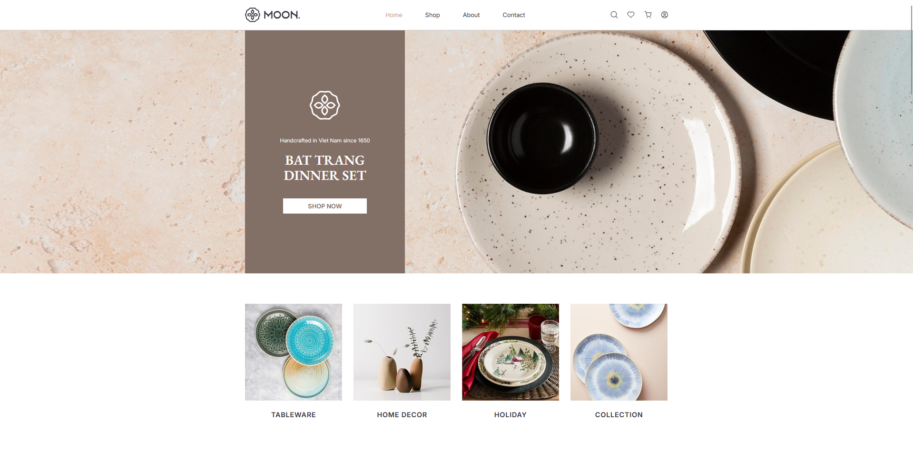

# 🏺 Moon Ceramic - Premium E-Commerce Website

<div align="center">
  <br><br><br>

  

  <br><br><br><br>
</div>

A beautifully crafted e-commerce website for Moon Ceramic, showcasing premium ceramic furniture and home decor products. Built with modern Angular 21 and Tailwind CSS for a responsive, elegant shopping experience.

**🔗 Repository:** [https://github.com/lavleshdubey90/moon.git](https://github.com/lavleshdubey90/moon.git)

## 🎨 Design

[**View Figma Design**](https://www.figma.com/design/o9GXhMmQHEQ50HQwS6th2u/Moon-Ceramic---Furniture-Store-ECommerce-Website-Shop--Community-)

## 🌐 Live Demo

[**View Live Site**](https://localhost:4200/) - Running locally with `ng serve`

## 📸 Preview

<div align="center">
  
</div>

## ✨ Features

- 🛍 **Product Catalog** - Browse beautiful ceramic products with filtering
- 🛒 **Shopping Cart** - Full cart management with quantity controls
- 💳 **Checkout Process** - Secure payment flow with billing details
- 📱 **Fully Responsive** - Mobile-first design that works on all devices
- 🎯 **Product Details** - Detailed product pages with image galleries
- 🍞 **Breadcrumbs** - Easy navigation throughout the site
- 🔍 **Search Functionality** - Find products quickly
- 📧 **Newsletter Signup** - Stay updated with new arrivals
- 📱 **Social Integration** - Connected social media profiles

## 🛠️ Tech Stack

- **Frontend**: Angular 21.0.0
- **Styling**: Tailwind CSS 4.1.12
- **Build Tool**: Angular CLI 21.0.4
- **Package Manager**: npm 11.6.4
- **TypeScript**: 5.9.2
- **Testing**: Vitest 4.0.8

## 📁 Project Structure

```
src/
├── app/
│   ├── components/
│   │   ├── header/          # Navigation header
│   │   ├── footer/          # Site footer
│   │   ├── shared/          # Reusable components
│   │   │   ├── breadcrumb/    # Navigation breadcrumbs
│   │   │   ├── brand-story/   # Story sections
│   │   │   ├── contact-form/  # Contact form
│   │   │   ├── filters/       # Product filters
│   │   │   ├── newsletter/    # Newsletter signup
│   │   │   └── product-card/  # Product display card
│   │   └── map/             # Location map
│   └── pages/
│       ├── homepage/         # Landing page
│       ├── shop/            # Product listing
│       ├── product/         # Individual product
│       ├── cart/            # Shopping cart
│       ├── checkout/         # Checkout process
│       ├── contact/         # Contact page
│       ├── about/           # About us
│       └── blogs/           # Blog section
├── public/                 # Static assets
│   ├── icons/              # UI icons
│   ├── images/             # Product images
│   └── svgs/              # SVG assets
└── styles/                # Global styles
```

## 🚀 Getting Started

### Prerequisites

- Node.js 18+ and npm
- Angular CLI 21.0.0+

### Installation

1. **Clone the repository**
   ```bash
   git clone <repository-url>
   cd moon
   ```

2. **Install dependencies**
   ```bash
   npm install
   ```

3. **Start development server**
   ```bash
   npm start
   # or
   ng serve
   ```

4. **Open your browser**
   Navigate to `http://localhost:4200/`

## 🛠️ Development

### Available Scripts

```bash
# Start development server
npm start

# Build for production
npm run build

# Run tests
npm test

# Watch for changes (development build)
npm run watch
```

### Code Generation

Generate new components using Angular CLI:

```bash
# Generate a new component
ng generate component component-name

# Generate a new page
ng generate component pages/page-name

# List all available schematics
ng generate --help
```

## 📦 Building & Deployment

### Production Build

```bash
npm run build
```

The build artifacts will be stored in the `dist/` directory, optimized for production.

### Deployment

The application can be deployed to any static hosting service:
- Netlify
- Vercel
- GitHub Pages
- AWS S3 + CloudFront
- Any static hosting provider


## 🎯 Key Components

### Product Card
Reusable component for displaying products with:
- Product image
- Name and price
- Quick add to cart
- Responsive design

### Shopping Cart
Full cart functionality with:
- Item quantity management
- Remove items
- Coupon codes
- Price calculations
- Responsive table layout

### Checkout Process
Complete checkout flow with:
- Billing details form
- Order summary
- Payment method selection
- Form validation

## 📱 Responsive Design

- **Mobile**: Optimized for 320px - 768px
- **Tablet**: Optimized for 768px - 1024px  
- **Desktop**: Optimized for 1024px+

## 🎨 Design System

- **Colors**: Neutral palette with light brown accents
- **Typography**: Inter font family
- **Spacing**: Consistent 8px grid system
- **Components**: Reusable UI components

## 🤝 Contributing

1. Fork the repository
2. Create a feature branch (`git checkout -b feature/amazing-feature`)
3. Commit your changes (`git commit -m 'Add amazing feature'`)
4. Push to the branch (`git push origin feature/amazing-feature`)
5. Open a Pull Request

## 🌟 Design Credit

The beautiful Figma UI design for this project was created by **Hong Nguyen Ngo** - A talented designer.

- **Figma Profile**: [https://www.figma.com/@hongnguyenngo](https://www.figma.com/@hongnguyenngo)

